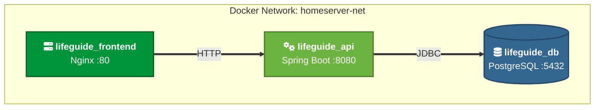

 

  

**A self-hosted, full-stack personal productivity suite.**  
Track habits, manage tasks, plan workouts, share shopping lists, and more — all in one sleek, dark-themed app built for your homeserver.

 

 

---

## ✨ Features

| Module | Description |
|---|---|
| 📋 **Tasks** | Create, complete, and manage your to-do items |
| 🔥 **Habits** | Track daily habits with streak counters and completion history |
| 💪 **Fitness Tracker** | Build workout routines, log exercises with sets/reps/weight, drag & drop to reorder, and track body weight over time with a live graph |
| 📌 **Pins** | Save notes, links, and ideas as color-coded pin cards |
| 🛒 **Shopping Lists** | Create shared lists, invite other users, and check off items in real time |
| ✉️ **Inbox** | Internal messaging system for user-to-user communication |
| 🧑‍💼 **Admin Dashboard** | Manage users, roles, and account setup from a dedicated admin panel |
| 🏠 **Dashboard** | Personalized hub with daily insights — habit score, streak, and pending tasks at a glance |

---

## 🛠 Tech Stack

### Backend — `api/`
| Technology | Version | Role |
|---|---|---|
| **Spring Boot** | 4.0 | REST API framework |
| **Spring Security + JWT** | — | Stateless authentication |
| **Spring Data JPA** | — | ORM & database access |
| **PostgreSQL** | 15 | Primary database |
| **Java** | 21 | Runtime |
| **Gradle** | — | Build tool |

### Frontend — `frontend/`
| Technology | Version | Role |
|---|---|---|
| **React** | 19 | UI framework |
| **TypeScript** | 5.9 | Type-safe JavaScript |
| **Vite** | 5 | Build tool & dev server |
| **React Router** | 7 | Client-side routing |
| **Recharts** | 3 | Weight trend charts |
| **Lucide React** | — | Icon library |
| **Axios** | — | HTTP client |
| **Vanilla CSS** | — | Glassmorphism design system |

### Infrastructure
| Technology | Role |
|---|---|
| **Docker + Docker Compose** | Containerisation of all three services |
| **Nginx** | Serves the frontend and proxies API requests |
| **GitHub Actions** | CI/CD — auto-deploy to homeserver on push to `main` |

---

## 🏗️ Architecture

Our services are isolated within a dedicated Docker network (`homeserver-net`) to ensure secure, internal-only communication between the backend and database.

### Component Breakdown

* **`homeserver-net`**: The isolated private network encapsulating the services.
* **`lifeguide_frontend`**: The web server running **Nginx** on port `80`. It serves static assets and acts as a reverse proxy, forwarding requests to the backend API.
* **`lifeguide_api`**: The backend application running **Spring Boot** on port `8080`. It handles the core business logic.
* **`lifeguide_db`**: The database running **PostgreSQL** on port `5432`. It persists application data and communicates securely with the API via JDBC.

## 📄 License

This project is personal / homelab software. Feel free to fork and adapt it for your own setup.

